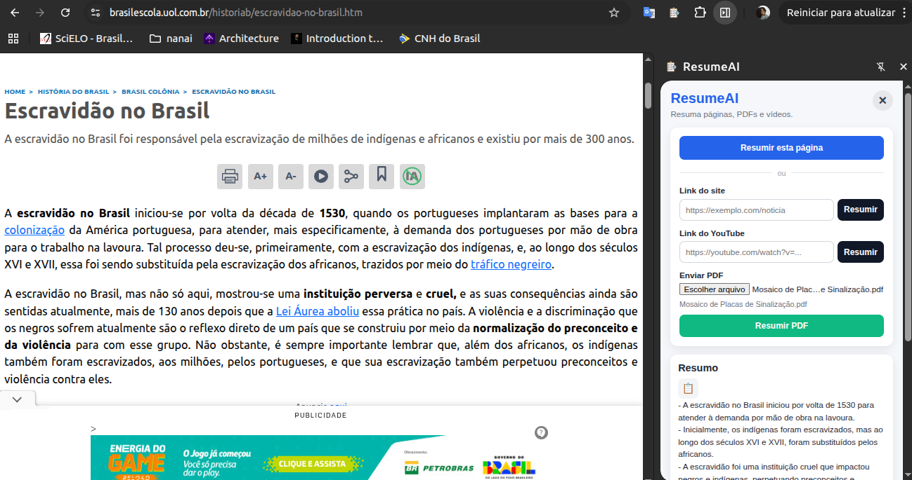

# ResumeAI - Extensão para Resumo de Textos

ResumeAI é uma extensão para Google Chrome que permite resumir conteúdos de páginas web, arquivos PDF e vídeos do YouTube usando um backend em Python.

A extensão abre em um painel lateral do navegador, permitindo que o usuário continue navegando sem perder a tela do resumidor.



## Funcionalidades

* Resumir a página atual aberta no navegador.
* Enviar um link de site para resumo.
* Enviar um link de vídeo do YouTube para resumo.
* Fazer upload de arquivos PDF.
* Exibir o resumo em formato de tópicos.
* Integração com API backend em Python.

## Estrutura da Extensão

```text
resumeai-extension/
├── manifest.json
├── background.js
├── app.html
├── app.css
├── app.js
├── content.js
└── icons/
    └── icon.png
```

## Como usar

### 1. Inicie o backend

Antes de usar a extensão, o servidor Python precisa estar rodando.

Exemplo:

```bash
docker compose up --build
```

Ou, se estiver rodando localmente:

```bash
uvicorn main:app --reload
```

A API deve estar disponível em:

```text
http://localhost:8000
```

### 2. Carregue a extensão no Chrome

Abra o navegador e acesse:

```text
chrome://extensions/
```

Depois:

1. Ative o **Modo do desenvolvedor**.
2. Clique em **Carregar sem compactação**.
3. Selecione a pasta da extensão, por exemplo:

```text
resumeai-extension/
```

4. A extensão será adicionada ao navegador.

### 3. Abra o painel lateral

Clique no ícone da extensão **ResumeAI** na barra do Chrome.

A extensão será aberta no painel lateral do navegador.

### 4. Resumir a página atual

Para resumir o site que está aberto no momento:

1. Abra uma página no navegador.
2. Clique no ícone da extensão.
3. Clique no botão **Resumir esta página**.
4. Aguarde o processamento.
5. O resumo será exibido na tela.

### 5. Resumir um link de site

Para resumir uma página específica por link:

1. Cole o link no campo **Link do site**.
2. Clique em **Resumir**.
3. Aguarde o retorno da API.
4. O resumo será exibido em tópicos.

### 6. Resumir um vídeo do YouTube

Para resumir um vídeo:

1. Cole o link do vídeo no campo **Link do YouTube**.
2. Clique em **Resumir**.
3. A extensão enviará o link para o backend.
4. O resumo será exibido após o processamento.

### 7. Resumir um PDF

Para resumir um arquivo PDF:

1. Clique no campo de envio de arquivo.
2. Selecione um arquivo `.pdf`.
3. Clique em **Resumir PDF**.
4. Aguarde o envio e processamento.
5. O resumo será exibido no painel lateral.

## Rotas esperadas no backend

A extensão espera que o backend tenha as seguintes rotas:

```text
POST /summarize/html?model=t5
POST /summarize/pdf?model=t5
POST /summarize/video?model=t5
```

### Exemplo de envio para HTML

```json
{
  "url": "https://exemplo.com",
}
```

### Exemplo de envio para vídeo

```json
{
  "url": "https://youtube.com/watch?v=..."
}
```

### Exemplo de envio para PDF

O PDF é enviado como `multipart/form-data`, usando o campo:

```text
file
```

## Observações

* O backend precisa estar rodando antes de usar a extensão.
* A extensão usa `http://localhost:8000` como endereço padrão da API.
* Caso a API esteja em outra porta ou domínio, altere a variável `API_BASE_URL` no arquivo `app.js`.
* O resumo depende do modelo escolhido no backend, como `t5` ou `gpt`.
* Para usar GPT, é necessário configurar corretamente a chave da OpenAI no backend.


